# 📊 Diagramas de Fluxo - Arquitetura Hexagonal

## 1. Visão Geral da Arquitetura


---

## 2. Fluxo Completo: Criar Pedido (POST)


---

## 3. Fluxo Completo: Confirmar Pedido (PUT)

```mermaid
sequenceDiagram
    participant Client as Cliente HTTP
    participant Controller as OrderController
    participant Port as ConfirmOrderPort
    participant Service as OrderService
    participant RepoPort as OrderRepositoryPort
    participant Adapter as OrderJpaAdapter
    participant JPA as Spring JPA
    participant DB as Database
    participant PayPort as PaymentPort
    participant PayAdapter as PaymentClientAdapter
    participant PayAPI as Payment Service
    participant Domain as Order (Entity)
    
    Client->>Controller: PUT /orders/{id}/confirm
    activate Controller
    
    Controller->>Port: confirm(orderId)
    activate Port
    
    Port->>Service: confirm(orderId)
    activate Service
    
    Note over Service: 1. Buscar pedido
    Service->>RepoPort: findById(orderId)
    activate RepoPort
    
    RepoPort->>Adapter: findById(orderId)
    activate Adapter
    
    Adapter->>JPA: findById(UUID)
    activate JPA
    
    JPA->>DB: SELECT * FROM orders<br/>WHERE id = ?
    activate DB
    DB-->>JPA: OrderEntity
    deactivate DB
    
    JPA-->>Adapter: Optional<OrderEntity>
    deactivate JPA
    
    Note over Adapter: entity.toDomain()
    Adapter-->>RepoPort: Optional<Order>
    deactivate Adapter
    
    RepoPort-->>Service: Optional<Order>
    deactivate RepoPort
    
    Note over Service: .orElseThrow()
    Service->>Service: Order encontrado
    
    Note over Service: 2. Processar pagamento
    Service->>PayPort: process(orderId, total)
    activate PayPort
    
    PayPort->>PayAdapter: process(orderId, total)
    activate PayAdapter
    
    PayAdapter->>PayAPI: POST /payments<br/>{orderId, amount}
    activate PayAPI
    
    Note over PayAPI: Valida cartão<br/>Cobra valor<br/>Retorna aprovação
    
    PayAPI-->>PayAdapter: {approved: true}
    deactivate PayAPI
    
    PayAdapter-->>PayPort: true
    deactivate PayAdapter
    
    PayPort-->>Service: true (aprovado)
    deactivate PayPort
    
    Note over Service: 3. Confirmar pedido
    Service->>Domain: order.confirm()
    activate Domain
    
    Note over Domain: Valida status = PENDING<br/>Retorna novo Order<br/>com status = CONFIRMED
    
    Domain-->>Service: Order (confirmado)
    deactivate Domain
    
    Note over Service: 4. Salvar pedido confirmado
    Service->>RepoPort: save(confirmedOrder)
    activate RepoPort
    
    RepoPort->>Adapter: save(order)
    activate Adapter
    
    Note over Adapter: OrderEntity.from(order)
    Adapter->>JPA: save(entity)
    activate JPA
    
    JPA->>DB: UPDATE orders<br/>SET status = 'CONFIRMED'<br/>WHERE id = ?
    activate DB
    DB-->>JPA: Updated
    deactivate DB
    
    JPA-->>Adapter: OrderEntity
    deactivate JPA
    
    Note over Adapter: entity.toDomain()
    Adapter-->>RepoPort: Order
    deactivate Adapter
    
    RepoPort-->>Service: Order
    deactivate RepoPort
    
    Service-->>Port: Order (confirmado)
    deactivate Service
    
    Port-->>Controller: Order
    deactivate Port
    
    Note over Controller: OrderResponse.from(order)
    Controller-->>Client: 200 OK<br/>OrderResponse JSON
    deactivate Controller
```



---

## 4. Camadas e Dependências

```mermaid
graph TD
    subgraph "LAYER 1 - Infrastructure (Frameworks)"
        A1[Spring Framework]
        A2[Hibernate/JPA]
        A3[Jackson JSON]
        A4[Tomcat]
    end
    
    subgraph "LAYER 2 - Adapters (Implementações)"
        B1[OrderController<br/>REST]
        B2[OrderJpaAdapter<br/>Persistence]
        B3[PaymentClientAdapter<br/>HTTP]
        B4[OrderEntity<br/>JPA Entity]
    end
    
    subgraph "LAYER 3 - Ports (Interfaces)"
        C1[CreateOrderPort<br/>Input]
        C2[ConfirmOrderPort<br/>Input]
        C3[OrderRepositoryPort<br/>Output]
        C4[PaymentPort<br/>Output]
    end
    
    subgraph "LAYER 4 - Domain (Core Business)"
        D1[OrderService<br/>Use Cases]
        D2[Order<br/>Entity]
        D3[OrderStatus<br/>Enum]
    end
    
    A1 --> B1
    A2 --> B2
    A2 --> B4
    A3 --> B1
    
    B1 --> C1
    B1 --> C2
    B2 --> C3
    B3 --> C4
    
    C1 --> D1
    C2 --> D1
    D1 --> C3
    D1 --> C4
    
    D1 --> D2
    D2 --> D3
    
    style D1 fill:#e1f5ff
    style D2 fill:#e1f5ff
    style D3 fill:#e1f5ff
    style C1 fill:#fff3cd
    style C2 fill:#fff3cd
    style C3 fill:#fff3cd
    style C4 fill:#fff3cd
    style B1 fill:#d4edda
    style B2 fill:#d4edda
    style B3 fill:#d4edda
```



**Legenda:**
- 🔵 **Domain (Azul)** - Lógica pura de negócio, sem dependências externas
- 🟡 **Ports (Amarelo)** - Interfaces que definem contratos
- 🟢 **Adapters (Verde)** - Implementações concretas que usam frameworks
- ⚫ **Infrastructure (Cinza)** - Frameworks e bibliotecas externas

---

## 5. Conversão de Dados (DTOs)


**Exemplo de dados em cada camada:**

### CreateOrderRequest (JSON)
```json
{
  "clientId": "client-123",
  "total": 150.50
}
```

### Order (Domain)
```java
Order {
  id: UUID("550e8400-e29b-41d4-a716-446655440000"),
  clientId: "client-123",
  total: BigDecimal(150.50),
  status: OrderStatus.PENDING,
  createdAt: LocalDateTime("2024-01-15T10:30:00")
}
```

### OrderEntity (JPA)
```java
OrderEntity {
  id: UUID("550e8400-e29b-41d4-a716-446655440000"),
  clientId: "client-123",
  total: BigDecimal(150.50),
  status: OrderStatus.PENDING,
  createdAt: LocalDateTime("2024-01-15T10:30:00")
}
```

### Database (SQL)
```sql
| id                                   | client_id   | total  | status  | created_at          |
|--------------------------------------|-------------|--------|---------|---------------------|
| 550e8400-e29b-41d4-a716-446655440000 | client-123  | 150.50 | PENDING | 2024-01-15 10:30:00 |
```

### OrderResponse (JSON)
```json
{
  "id": "550e8400-e29b-41d4-a716-446655440000",
  "clientId": "client-123",
  "total": 150.50,
  "status": "PENDING"
}
```

---

## 6. Ciclo de Vida de um Bean Spring


**Exemplo prático:**

```java
@Component
public class OrderService {
    
    private final OrderRepositoryPort repository;
    
    // 1. Construtor chamado (injeção de dependência)
    public OrderService(OrderRepositoryPort repository) {
        System.out.println("1. Constructor called");
        this.repository = repository;
    }
    
    // 2. Após injeção de dependências
    @PostConstruct
    public void init() {
        System.out.println("2. @PostConstruct - Bean initialized");
    }
    
    // 3. Bean pronto para uso
    public Order create(String clientId, BigDecimal total) {
        System.out.println("3. Bean in use");
        return Order.create(clientId, total);
    }
    
    // 4. Antes de destruir o bean
    @PreDestroy
    public void cleanup() {
        System.out.println("4. @PreDestroy - Bean destroyed");
    }
}
```

---

## 7. Tratamento de Erros (Exception Flow)


**Implementação de @ControllerAdvice:**

```java
@ControllerAdvice
public class GlobalExceptionHandler {
    
    @ExceptionHandler(IllegalArgumentException.class)
    public ResponseEntity<ErrorResponse> handleNotFound(IllegalArgumentException ex) {
        ErrorResponse error = new ErrorResponse(
            HttpStatus.NOT_FOUND.value(),
            ex.getMessage(),
            LocalDateTime.now()
        );
        return ResponseEntity.status(HttpStatus.NOT_FOUND).body(error);
    }
    
    @ExceptionHandler(Exception.class)
    public ResponseEntity<ErrorResponse> handleGeneric(Exception ex) {
        ErrorResponse error = new ErrorResponse(
            HttpStatus.INTERNAL_SERVER_ERROR.value(),
            "Internal server error",
            LocalDateTime.now()
        );
        return ResponseEntity.status(HttpStatus.INTERNAL_SERVER_ERROR).body(error);
    }
}
```

---

## 8. Transações (@Transactional)

```mermaid
sequenceDiagram
    participant Client
    participant Controller
    participant Service
    participant TxManager as Transaction Manager
    participant Repo1 as OrderRepository
    participant Repo2 as PaymentRepository
    participant DB
    
    Client->>Controller: POST /orders
    Controller->>Service: create(...)
    
    Note over Service: @Transactional detectado
    Service->>TxManager: Begin Transaction
    activate TxManager
    
    TxManager->>DB: BEGIN
    
    Service->>Repo1: save(order)
    Repo1->>DB: INSERT INTO orders
    
    Service->>Repo2: save(payment)
    Repo2->>DB: INSERT INTO payments
    
    alt Sucesso
        Service-->>TxManager: Commit
        TxManager->>DB: COMMIT
        TxManager-->>Service: Transaction committed
        deactivate TxManager
        Service-->>Controller: Order created
        Controller-->>Client: 201 Created
    else Exceção
        Service--xTxManager: Exception
        TxManager->>DB: ROLLBACK
        Note over DB: Todas alterações desfeitas
        TxManager--xService: Transaction rolled back
        deactivate TxManager
        Service--xController: Exception
        Controller-->>Client: 500 Error
    end
```

---

## 9. Profiles Spring (Dev vs Prod)


**Como ativar profiles:**

```bash
# Desenvolvimento
mvn spring-boot:run -Dspring-boot.run.profiles=dev

# Produção
java -jar app.jar --spring.profiles.active=prod
```

---

## 10. Container Spring (ApplicationContext)


**Como Spring resolve dependências:**

```java
// Spring faz automaticamente:
RestTemplate restTemplate = new RestTemplate();
OrderSpringJpaRepository jpaRepo = new OrderSpringJpaRepositoryImpl();
OrderJpaAdapter jpaAdapter = new OrderJpaAdapter(jpaRepo);
PaymentClientAdapter paymentAdapter = new PaymentClientAdapter(restTemplate);
OrderService service = new OrderService(jpaAdapter, paymentAdapter);
OrderController controller = new OrderController(service, service);

// Armazena tudo no ApplicationContext
```

---

## Como Visualizar Estes Diagramas

Estes diagramas usam **Mermaid**, suportado nativamente por:

### ✅ GitHub/GitLab
- Visualização automática em arquivos `.md`

### ✅ VS Code
- Extensão: "Markdown Preview Mermaid Support"

### ✅ IntelliJ IDEA
- Plugin: "Mermaid"

### ✅ Online
- https://mermaid.live/ - Editor online
- https://mermaid-js.github.io/ - Documentação oficial

### ✅ Exportar como imagem
```bash
# Instalar Mermaid CLI
npm install -g @mermaid-js/mermaid-cli

# Converter para PNG
mmdc -i diagrams.md -o diagram.png
```

---

**💡 Dica:** Salve este arquivo como `DIAGRAMS.md` no projeto!